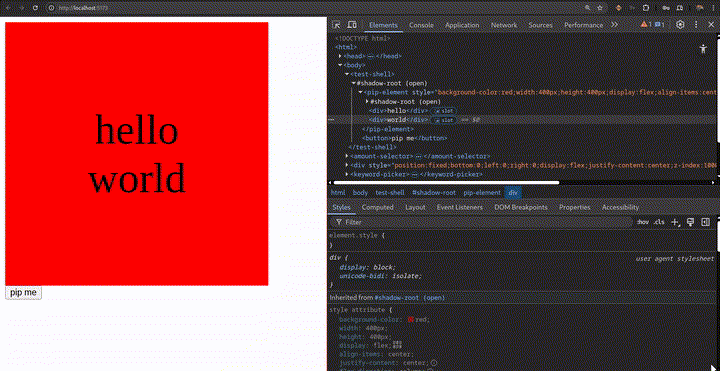

# pip-my-div *

* not to confuse with pimp my ride,

is a custom element helper to turn everything into a pip window.
Just like a video can be picture-in-picture and chill in one corner of your screen, so is any element on your web page.



The element was build on top of these awesome tools : [Lit](https://lit.dev/), [html2canvas](https://html2canvas.hertzen.com/), and the [native pip API](https://developer.mozilla.org/en-US/docs/Web/API/Picture-in-Picture_API).

## Pros

- Easy to install and use
- It uses a video stream in the background so the pip window will not include a window bar.
- It reflects the rendering of the DOM inside `<pip-element>` that means the content stays on your page and is just mirrored in the pip window.
- For the same reason above, no need to create a new context for the pip window (styles, scripts, etc...), WYSIWYG.

## Cons

- Experimental, not only the PIP API is still experimental so is this package. Do not use in serious production environment.
- Uses `html2canvas` in the background which can be pretty slow. Use this package only for sluggish content area (not animations.)
- The pip window updates when the content of your DOM changes, not when just styles change.

## Installation / How to use

Install
```bash
npm i -D pip-my-div
```

import the element's definition somewhere in your code
```ts
import 'pip-my-div'
```

then use it in your html

```html
<pip-element>
  <!-- content that you want to turn into picture in picture -->
</pip-element>
```

and using JS:

```js
const pipElement = document.querySelector('pip-element')
pipElement.pip()
```

